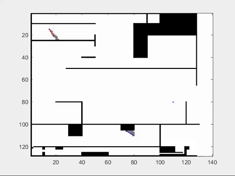
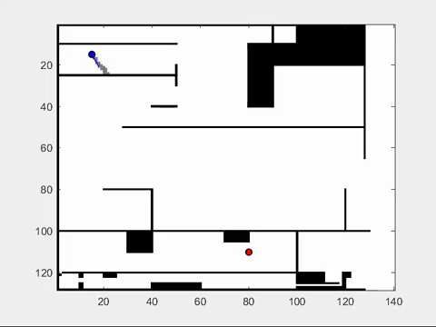

# Astar-Algorithm
An update of the Astar algorithm will be posted here

In the followingfollowing, the algorithms performance under search is examplified

The typical restriction of only being able to move in 45 degrees is not prsent. Instead multiple settings for connection distnace can be used. Se examples; 

By using the two-sided option, typically, the number of explored cells is significantly reduced, resulting in increased computation times;

                         
  

Multiple cells can be used; (With a possible application being to use the algorithm can be used for a robot to explore new areas)

 

 

 

 

 

 

Varying connecting distance etc..

Multiple goals etc
